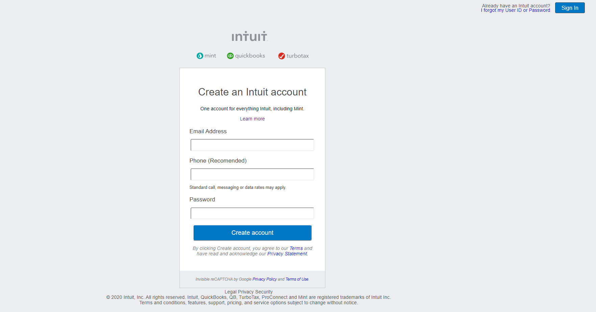

Initial Commit
A README
Microverse #2 Project ,  Main Course HTML & CSS, Sign up Forms.

                                          Main Preview

The focus of this project is to recreate with HTML and CSS the look of the mint.com sign up page, mainly using Css's grid box.

Built Using:

HTML  
CSS

Details:

  Centered Signup Form
  Built using mainly CSS Gridbox
  "Already have an account" button on top right

Authors:

Ignacio Asis:
  Github: @KennyUTN

  (https://github.com/KennyUTN)

Samuel Almao:
  Github: @SigmaSam

  (https://github.com/SigmaSam)
